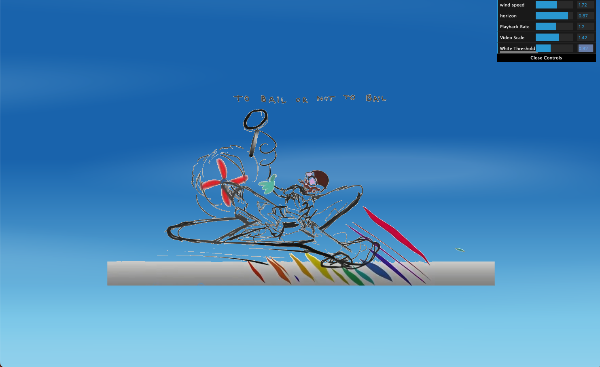

# bailNFT — *To Bail or Not to Bail*

https://github.com/qxaminer/bailNFT

A Three.js interactive piece featuring a hand-drawn animated figure flying through a procedurally generated sky.



---

## What it does

- Plays a video of a hand-drawn airplane animation keyed over a white background (white pixels are discarded in a GLSL fragment shader, making them transparent)
- Renders a scrolling sky background with cloud streaks via a custom GLSL shader — the scroll direction matches the airplane's flight angle
- The figure slides in with a spring animation (GSAP) on load
- A dat.GUI control panel lets you tweak the scene in real time:
  - **wind speed** — how fast the sky scrolls
  - **horizon** — vertical position of the sky gradient
  - **Playback Rate** — speed of the video
  - **Video Scale** — size of the airplane figure
  - **White Threshold** — sensitivity of the white-key chroma removal

---

## Stack

- [Three.js](https://threejs.org/) — WebGL rendering, custom GLSL shaders, video texture
- [GSAP](https://gsap.com/) — entrance animation
- [dat.GUI](https://github.com/dataarts/dat.gui) — runtime parameter controls
- TypeScript + Webpack

---

## Running locally

**Prerequisites:** Node.js 18+

```bash
# 1. Clone the repo
git clone https://github.com/qxaminer/bailNFT.git
cd bailNFT

# 2. Install dependencies
npm install

# 3. Start the dev server
npm run dev
```

Opens automatically at `http://localhost:8080`.

---

## Build for production

```bash
npm run build
```

Output goes to `dist/`. Serve `dist/index.html` with any static file server.

---

## Project structure

```
src/
  index.ts        # All Three.js scene logic, shaders, GUI
  index.html      # HTML entry point
  assets/
    bailNFT.mp4   # Source video (hand-drawn animation on white)
```
